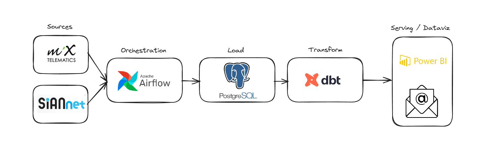

# POC - Inteligência através de Telemetria

## 1. Introdução

### 1.1 Propósito do Documento
> Este documento visa apresentar a estrutura, implementação e potenciais benefícios da Prova de Conceito (POC) de telemetria na frota de ônibus da empresa HP Transportes. O foco está em demonstrar o potencial de transformação e otimização do negócio por meio da coleta e análise de dados.

### 1.2 Escopo da POC
> A POC abrange a coleta de dados de telemetria de uma seleção de 10 ônibus, processamento desses dados, e a criação de dashboards interativos para análise e tomada de decisão. O escopo inclui:

* Coleta de dados via API de telemetria.
* Armazenamento temporário de dados.
* Análise e processamento de dados.
* Desenvolvimento de dashboards para visualização de insights.
* Criar documentação.
## 2. Objetivos da POC
> Demonstrar o potencial de impacto da telemetria no Aumento da eficiência operacional.
> Como primeiro teste, iremos ler os dados do endpoint (GEODATA) que possui os dados de geolocalização de todos os carros
> durante o dia. A POC consiste em comparar o trajeto realizado pelo carro (telemetria) com o trajeto programado e alertar 
> o cliente para aqueles carros que tiveram um desvio acima do que foi definido como regra de negócio.
## 3. Tecnologias Utilizadas
* API de Telemetria: Descrição da API e como os dados serão coletados.
* Banco de Dados Temporário: PostgreSQL.
* Ferramentas de ETL: Airflow e DBT.
* Plataforma de Dashboard: Power BI.
## 4. Arquitetura da Solução

## 5. Implementação
### 5.1 Coleta de Dados
> A coleta de dados consiste em criar pipelines no Apache Airflow para obter dados das API's da Mix Telematics e do SianNet

### 5.2 Processamento de Dados
> O processamento dos dados consiste na utilização do DBT que trata os dados em nível de banco e dados, gerando documentação de 
> tudo o que é realiado.

### 5.3 Desenvolvimento dos Dashboards
> Criação de um dashboard no Power BI no qual será demonstrado as linhas, eventos e os dias como dimensões/métricas.
> Envio de relatório com as ocorrências negativas por email.

## 6. Resultados Esperados
* Demonstração de como a telemetria pode oferecer insights para a otimização de rotas.
* Projeção de economia com a redução de custos operacionais.
* Estimativa de melhoria na manutenção preventiva dos veículos.
* Avaliação do potencial de melhoria na satisfação dos usuários.
## 7. Conclusão
> O Projeto demonstrou que os ganhos que o negócio pode alcançar vão muito além do que somente economia de combustível.
> Poderemos traçar perfis de motoristas, perfis de acidentes, realizar testes de uso de peças. Se enriquecido com outras informações
> como por exemplo, data e localização de eventos, previsões e dados metereológicos históricos, entre outros. Podemos obter insights
> ainda mais valiosos.
> 